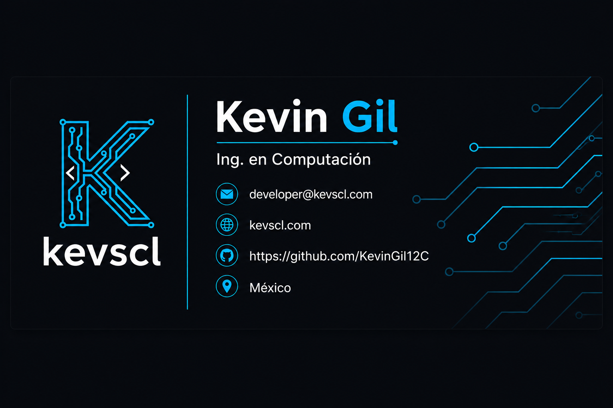

<div align="center">
  
</div>

<div align="center">
  
</div>

<div align="center">
  
  
  
</div>

<div align="center">
  <a href="https://github.com/KevinGil12C" target="_blank"></a>
  <a href="https://linkedin.com" target="_blank"></a>
  <a href="mailto:kebo.jcg77@gmail.com" target="_blank"></a>
  <a href="https://github.com/KevinGil12C" target="_blank"></a>
</div>

<div align="center">
  
  
  
</div>

---

## 🌌 Sobre Mí

Soy Ingeniero en Computación egresado de la Universidad Autónoma del Estado de México, especializado en desarrollo de software con un enfoque en ingeniería de backend y arquitectura de sistemas. Cuento con experiencia sólida en el patrón arquitectónico MVC, optimización avanzada de rendimiento y el diseño de sistemas transaccionales robustos orientados a entornos de producción empresariales.

A lo largo de mi trayectoria me he especializado en la construcción de servicios críticos utilizando PHP y sus frameworks principales, el diseño de APIs RESTful, la integración segura de pasarelas de pago transaccionales y la protección de aplicaciones contra vectores de ataque automatizados. Mi mentalidad de ingeniería de producto combina las metodologías de desarrollo full stack avanzadas con una rigurosa atención a la continuidad del negocio.

### 🎯 Abierto A
* Roles de Ingeniería Full Stack y Backend Junior
* Diseño de Arquitectura de Sistemas y Consultoría de Software
* Optimización de Infraestructura de Servicios y Seguridad Web

---

## 🛠️ Stack Tecnológico

### Lenguajes
<p align="left">
  
</p>

### Frontend
<p align="left">
  
</p>

### Backend & Databases
<p align="left">
  
</p>

### DevOps & Tooling
<p align="left">
  
</p>

---

## 🚀 Proyectos Destacados

### 📂 SecureFiles Suite
<details>
<summary><b>Ver Detalles del Proyecto</b></summary>

Suite avanzada local orientada al procesamiento multimedia, compresión, conversión de formatos de archivos y edición avanzada de documentos PDF.

| Dimensión | Especificación |
| :--- | :--- |
| **Stack** | JavaScript, Core Web Technologies, Estructuras Modulares |
| **Escala** | Gestión local multi-archivo con manipulación binaria optimizada |
| **Rendimiento** | Arquitectura ligera para compresión instantánea sin llamadas de red redundantes |
| **Seguridad** | Procesamiento seguro sin almacenamiento intermedio personal en el servidor |
| **Impacto** | Reducción de fricción de almacenamiento en entornos empresariales mediante compresión |
| **Repository** | [SecureFiles Framework](https://github.com/KevinGil12C/project_brief) |

Desarrollado bajo pautas modulares rígidas para garantizar el aislamiento y la velocidad de ejecución de las herramientas en el navegador.
</details>

### 📂 Lucybot Chatbot
<details>
<summary><b>Ver Detalles del Proyecto</b></summary>

Agente conversacional de ámbito académico diseñado con arquitectura modular para la resolución asíncrona de consultas estudiantiles estructuradas.

| Dimensión | Especificación |
| :--- | :--- |
| **Stack** | PHP, JavaScript, MySQL, Arquitectura Modular |
| **Escala** | Implementación a nivel institucional para la automatización de atención primaria |
| **Rendimiento** | Consultas asíncronas optimizadas e indexadas con tiempos de respuesta reducidos |
| **Seguridad** | Capas de sanitización estrictas para mitigar inyecciones relacionales SQL |
| **Impacto** | Reducción sustancial del tiempo de respuesta en la entrega de información académica |
| **Repository** | [Lucybot Core Ecosystem](https://github.com/KevinGil12C/project_brief) |

Un enfoque modular y desacoplado enfocado en mitigar la carga de peticiones recurrentes a las bases de datos de la escuela.
</details>

### 📂 Sistema de Gestión de Ventas Web
<details>
<summary><b>Ver Detalles del Proyecto</b></summary>

Plataforma integral de gestión comercial para pequeñas y medianas empresas desarrollada bajo un estricto control de seguridad estructural.

| Dimensión | Especificación |
| :--- | :--- |
| **Stack** | PHP, Patrón MVC, Autenticación Segura, Control de Roles |
| **Escala** | Diseñado para la resiliencia transaccional y financiera de PyMEs locales |
| **Rendimiento** | Indexación avanzada relacional para visualización ágil del estado de inventario |
| **Seguridad** | Control de acceso basado en roles (RBAC) y sesiones cifradas de usuario |
| **Impacto** | Digitalización y control centralizado de los flujos de caja y el almacenamiento de ventas |
| **Repository** | [Sales Management System](https://github.com/KevinGil12C/project_brief) |

Lógica de negocio robusta que implementa persistencia e integridad de datos en escenarios concurrentes de punto de venta.
</details>

### 📂 Sistema Multiagente con JADE
<details>
<summary><b>Ver Detalles del Proyecto</b></summary>

Infraestructura distribuida con agentes inteligentes orientada a procesos automáticos corporativos y generación dinámica de datos.

| Dimensión | Especificación |
| :--- | :--- |
| **Stack** | JADE, SQLite, Distribución de Procesos |
| **Escala** | Arquitectura distribuida para tareas complejas concurrentes |
| **Rendimiento** | Procesamiento asíncrono en paralelo con comunicación entre hilos |
| **Seguridad** | Aislamiento modular de agentes y consistencia en transacciones SQLite |
| **Impacto** | Generación automatizada y estructurada de reportes PDF analíticos |
| **Repository** | [Multi-Agent Core Engine](https://github.com/KevinGil12C/project_brief) |

Un entorno distribuido que reduce la sobrecarga algorítmica centralizada mediante agentes autónomos interconectados.
</details>

---

## 💼 Experiencia Profesional

### Programador Web
**Vivir Viajando** | *Febrero 2025 - Actualidad*
* **Refactorización Arquitectónica:** Actualización, mantenimiento y optimización integral de la plataforma bajo arquitectura estructurada MVC, mejorando la escalabilidad y estructura del código fuente.
* **Desarrollo Backend Enterprise:** Construcción de módulos robustos en PHP utilizando Laravel y Symfony, gestionando el ciclo de dependencias mediante Composer.
* **Pasarelas de Pago e Integración:** Desarrollo del sistema de reservas y pagos en línea con OpenPay, sincronizando datos de forma asíncrona entre servicios internos y APIs externas.
* **Servicios e Interconectividad:** Diseño e implementación de APIs RESTful optimizadas y comunicación bidireccional en tiempo real mediante WebSockets.
* **Seguridad Transaccional:** Auditoría proactiva de seguridad de código y despliegue de soluciones WAF con Rate Limiting para blindar el flujo transaccional y mitigar ataques automatizados.
* **Rendimiento y SEO Técnico:** Refactorización profunda orientada a la optimización de Core Web Vitals, logrando una reducción comprobable del 30% en los tiempos de carga del sitio.
* **Estrategias de Resiliencia:** Diseño e implementación de arquitecturas de tolerancia a fallas (*Intelligent Fallback*) para garantizar la continuidad operativa del negocio ante caídas de proveedores externos.
* `PHP` `Laravel` `Symfony` `MySQL` `OpenPay` `APIs REST` `WebSockets` `WAF` `Rate Limiting`

---

## 🏆 Logros

<div align="center">

| Reconocimiento | Detalles |
| :--- | :--- |
| **Acreditación de Ingeniería** | Conclusión formal satisfactoria del programa de Ingeniería en Computación de la UAEMéx. |
| **Optimización de Tiempos de Carga** | Reducción drástica del 30% en latencia web mediante optimización avanzada de código en producción. |
| **Blindaje Transaccional WAF** | Mitigación absoluta de solicitudes maliciosas automatizadas mediante Rate Limiting. |

</div>

---

## 📜 Certificaciones

### Oracle
* 

### Google
* 
* 

---

<div align="center">
  <a href="#kevin-jesús-coyote-gil"><b>Volver al Inicio ↑</b></a>
</div>

---

## 💻 Perfiles de Programación

<div align="center">
  <a href="https://github.com/KevinGil12C" target="_blank"></a>
</div>

---

## 📊 Analíticas de GitHub

<div align="center">
  
  <br />
  
  <br />
  
</div>

---

## 🏆 Trofeos de GitHub

<div align="center">
  
</div>

---

## 📈 Gráfico de Contribuciones

<div align="center">
  
</div>

---

## 🐍 Animación Snake de Contribuciones

<div align="center">
  
</div>

---

## 🎯 Enfoque Actual

```yaml
aprendiendo:
  - Optimización profunda en motores concurrentes de backend con PHP 8.4
  - Patrones avanzados de ciberseguridad defensiva y hardening de servidores web
construyendo:
  - Microservicios asíncronos y robustecimiento de sistemas CRM relacionales
explorando:
  - Automatizaciones CLI complejas para control de flujos de despliegue continuo
abierto_a:
  - Desafíos de arquitectura de bases de datos relacionales distribuidas y optimización de infraestructura empresarial
